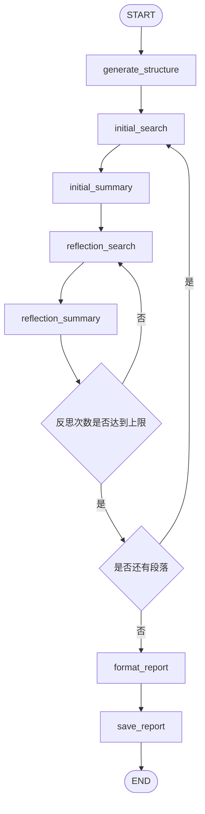
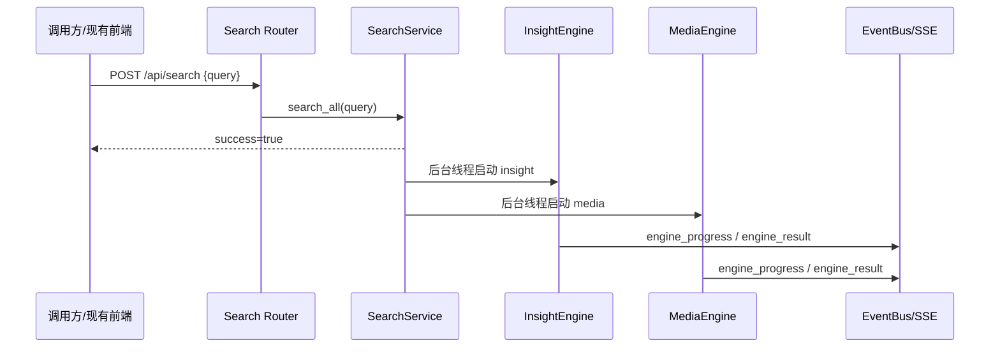
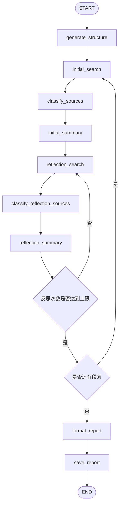
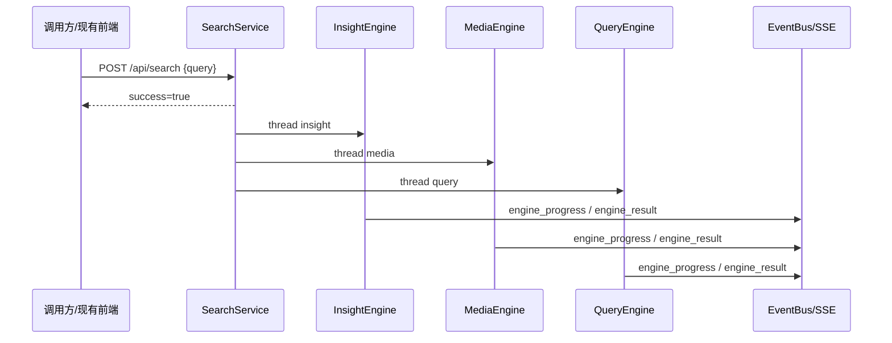
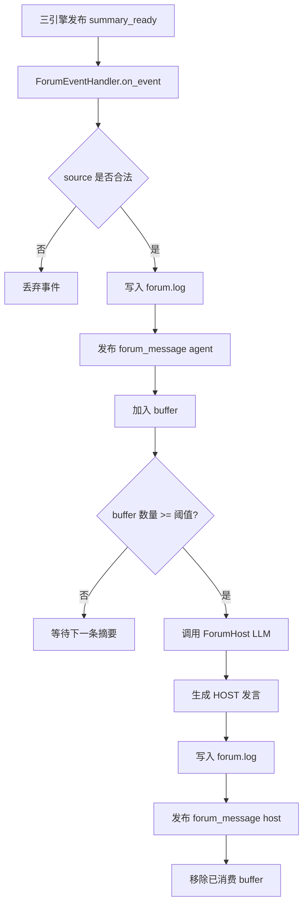
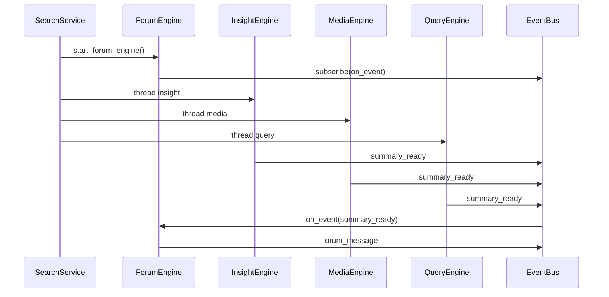

# 尚舆分析平台：MediaEngine、QueryEngine 与 ForumEngine 构建

本文档用于指导第二阶段编码，在已经完成项目脚手架、后端 API、InsightEngine 单引擎工作流的基础上，继续实现：

- MediaEngine：网络媒体搜索与传播路径分析。
- QueryEngine：权威来源查询与事实核验。
- SearchService：从单引擎扩展为多引擎并行编排。
- ForumEngine：监听三引擎摘要，生成主持人讨论意见。

本文档是程序员编码前的设计文档，要求程序员可以直接按文档进行模块开发和验收。

---

## 01. MediaEngine 网络搜索研究流

### 1.1 目标

构建 MediaEngine，用于从互联网公开信息、新闻报道、媒体内容中收集材料，分析事件传播路径、媒体关注点、公众讨论热度和报道角度。

MediaEngine 与 InsightEngine 的区别：

| 引擎 | 数据来源 | 核心关注点 |
| --- | --- | --- |
| InsightEngine | 本地舆情数据库 | 社交媒体评论、公众情绪、本地私域数据 |
| MediaEngine | 外部搜索 API | 新闻报道、媒体传播、公开网页资料 |

### 1.2 需要做的事情

| 序号 | 任务 | 说明 |
| --- | --- | --- |
| 1 | 创建 MediaEngine 模块 | 新增 `engines/MediaEngine/` 目录，复用 InsightEngine 的工作流结构 |
| 2 | 增加 MediaEngine 配置 | 增加 Media LLM、搜索工具类型、搜索 API Key、输出目录等配置 |
| 3 | 实现网络搜索工具 | 支持 Tavily、Bocha、Anspire 三类搜索工具 |
| 4 | 实现 MediaEngine 节点 | 实现结构生成、初始搜索、初始总结、反思搜索、反思总结、报告格式化、报告保存 |
| 5 | 接入 SearchService | 增加 `_run_media_research()`，支持从后端任务中启动 MediaEngine |
| 6 | 添加测试 | 使用 MockSearch 和 MockLLM 验证 MediaEngine e2e 链路 |

### 1.3 本步骤新增目录

```text
engines/
└── MediaEngine/
    ├── __init__.py
    ├── agent.py
    ├── context.py
    ├── graph.py
    ├── state.py
    ├── llms/
    │   ├── __init__.py
    │   └── base.py
    ├── nodes/
    │   ├── __init__.py
    │   ├── generate_structure.py
    │   ├── initial_search.py
    │   ├── initial_summary.py
    │   ├── reflection_search.py
    │   ├── reflection_summary.py
    │   ├── format_report.py
    │   └── save_report.py
    ├── tools/
    │   ├── __init__.py
    │   └── search.py
    ├── prompts/
    │   ├── __init__.py
    │   └── prompts.py
    └── utils/
        ├── __init__.py
        └── text_processing.py
data/
└── report/
    └── media/
```

### 1.4 本步骤新增配置

| 配置项 | 类型 | 默认值 | 说明 |
| --- | --- | --- | --- |
| `MEDIA_ENGINE_API_KEY` | string/null | null | MediaEngine LLM API Key |
| `MEDIA_ENGINE_BASE_URL` | string/null | null | MediaEngine LLM Base URL |
| `MEDIA_ENGINE_MODEL_NAME` | string | `gemini-2.5-pro` | MediaEngine LLM 模型名 |
| `SEARCH_TOOL_TYPE` | string | `TavilyAPI` | 网络搜索工具类型，支持 `TavilyAPI`、`BochaAPI`、`AnspireAPI` |
| `TAVILY_API_KEY` | string/null | null | Tavily 搜索 API Key |
| `BOCHA_WEB_SEARCH_API_KEY` | string/null | null | Bocha 搜索 API Key |
| `BOCHA_BASE_URL` | string/null | `https://api.bocha.cn/v1/ai-search` | Bocha 搜索地址 |
| `ANSPIRE_API_KEY` | string/null | null | Anspire 搜索 API Key |
| `ANSPIRE_BASE_URL` | string/null | null | Anspire 搜索地址 |
| `MEDIA_OUTPUT_DIR` | string | `data/report/media` | MediaEngine 输出目录 |
| `SEARCH_CONTENT_MAX_LENGTH` | int | `20000` | 搜索内容送入 LLM 前的最大长度 |
| `MAX_REFLECTIONS` | int | `2` | 最大反思次数 |

### 1.5 MediaEngine 对外入口

```python
def run_research(
    query: str,
    config: Settings,
    llm_client: LLMClient,
    search_agency: Any,
    progress_callback: Optional[Callable] = None,
    save_report: bool = True,
) -> dict:
    ...
```

返回结构与 InsightEngine 保持一致：

| 字段 | 类型 | 说明 |
| --- | --- | --- |
| `final_report` | string | 最终 Markdown 报告 |
| `report_title` | string | 报告标题 |
| `is_completed` | bool | 是否完成 |
| `paragraphs` | list | 段落状态、搜索记录和总结内容 |

### 1.6 MediaEngine 工作流



图中描述的是 MediaEngine 的研究流。整体结构与 InsightEngine 一致，但搜索节点调用的是外部网络搜索工具。`initial_search` 获取网页、新闻、图片或 AI 摘要材料，`initial_summary` 形成媒体报道角度的段落初稿，`reflection_search` 根据段落不足继续补充搜索，最后生成 Markdown 媒体研究报告。

### 1.7 网络搜索工具设计

MediaEngine 的搜索工具必须通过统一 `search_agency` 注入。节点不直接判断具体搜索厂商，只调用搜索工具提供的方法。

| 搜索工具 | 类名 | 适用场景 | 主要产物 |
| --- | --- | --- | --- |
| Tavily | `TavilySearchWrapper` / `TavilyNewsAgency` | 通用网页搜索、新闻搜索、最近报道 | 网页标题、URL、摘要、发布时间、相关性分数 |
| Bocha | `BochaMultimodalSearch` | 综合搜索、多模态搜索、结构化卡片 | 网页、图片、AI 总结、模态卡 |
| Anspire | `AnspireAISearch` | AI 搜索增强、综合搜索 | 网页结果、相关性分数 |

统一搜索结果建议结构：

| 字段 | 类型 | 说明 |
| --- | --- | --- |
| `title` | string | 网页或新闻标题 |
| `url` | string | 来源链接 |
| `content` | string | 摘要或正文片段 |
| `score` | float/null | 相关性分数 |
| `published_date` | string/null | 发布时间 |
| `source_type` | string | `webpage`、`image`、`modal_card` 等 |

### 1.8 工具选择策略

| 分析意图 | 优先工具能力 |
| --- | --- |
| 了解事件公开报道概况 | 通用网页搜索 |
| 获取最近 24 小时最新动态 | 时效搜索 |
| 获取过去一周主要报道 | 周度搜索 |
| 需要图像、百科、结构化信息 | Bocha 多模态/模态卡 |
| 需要快速获取原始网页材料 | 纯网页搜索 |

### 1.9 边界情况

| 场景 | 处理方式 |
| --- | --- |
| 搜索 API Key 缺失 | MediaEngine 启动失败，SearchService 发布 `engine_error` |
| 搜索 API 超时 | 重试；仍失败则当前段落返回空搜索结果或错误说明 |
| 搜索结果为空 | 生成说明性段落，不直接中断整个引擎 |
| 不支持的 `SEARCH_TOOL_TYPE` | 使用默认 Tavily 或返回明确错误 |
| 搜索内容过长 | 按 `SEARCH_CONTENT_MAX_LENGTH` 截断后再送入 LLM |

---

## 02. SearchService 双引擎并行改造

### 2.1 目标

在已有 InsightEngine 的基础上，改造 SearchService，使 `/api/search` 能同时启动 InsightEngine 和 MediaEngine，并通过现有事件机制向前端推送两个引擎的进度和结果。

### 2.2 需要做的事情

| 序号 | 任务 | 说明 |
| --- | --- | --- |
| 1 | 扩展输出目录 | 增加 `data/report/media` |
| 2 | 扩展任务启动逻辑 | `/api/search` 同时启动 `insight`、`media` 两个后台线程 |
| 3 | 增加 `_run_media_research()` | 构造 MediaEngine 配置、LLMClient、search_agency |
| 4 | 增加日志分流 | 将 MediaEngine 日志写入 `logs/media.log` |
| 5 | 扩展最新结果读取 | `/api/search/latest` 返回 `insight` 和 `media` 两类结果 |
| 6 | 添加并行测试 | 验证一个引擎失败不影响另一个引擎 |

### 2.3 双引擎并行流程



图中描述的是双引擎并行流程。`POST /api/search` 不等待引擎完成，而是立即返回任务已启动。SearchService 分别创建 InsightEngine 和 MediaEngine 的后台线程，两个引擎互不阻塞，各自通过 `progress_callback` 发布进度和结果。

### 2.4 SearchService 行为变化

| 接口 | 原行为 | 新行为 |
| --- | --- | --- |
| `POST /api/search` | 启动 InsightEngine | 并行启动 InsightEngine、MediaEngine |
| `GET /api/search/latest` | 返回 InsightEngine 最近报告 | 返回 InsightEngine、MediaEngine 最近报告 |

### 2.5 边界情况

| 场景 | 处理方式 |
| --- | --- |
| InsightEngine 失败 | 发布 insight 的 `engine_error`，MediaEngine 继续执行 |
| MediaEngine 失败 | 发布 media 的 `engine_error`，InsightEngine 继续执行 |
| 两个引擎同时写日志 | 按引擎名称分流到不同日志文件 |
| 前端刷新 | `/api/search/latest` 从磁盘恢复最近结果 |

---

## 03. QueryEngine 权威核验研究流

### 3.1 目标

构建 QueryEngine，用于从权威来源、官方域名、权威媒体和学术来源中核查事实，补充 MediaEngine 和 InsightEngine 不能保证真实性的信息。

QueryEngine 的核心职责不是追踪舆论热度，而是判断信息可信度。

### 3.2 需要做的事情

| 序号 | 任务 | 说明 |
| --- | --- | --- |
| 1 | 创建 QueryEngine 模块 | 新增 `engines/QueryEngine/` 目录，结构与 MediaEngine 保持一致 |
| 2 | 增加 QueryEngine 配置 | 增加 Query LLM、Tavily API、输出目录配置 |
| 3 | 实现权威搜索工具 | 基于 Tavily 搜索，增加官方域名增强查询 |
| 4 | 实现来源可信度分类 | 新增 `source_classifier.py`，对 URL 做 deterministic 分类 |
| 5 | 实现 QueryEngine 节点 | 工作流与 MediaEngine 一致，但 prompt 和总结角度面向事实核验 |
| 6 | 接入 SearchService | 增加 `_run_query_research()` |
| 7 | 添加测试 | 测试权威域分类、权威增强查询、QueryEngine e2e |

### 3.3 本步骤新增目录

```text
engines/
└── QueryEngine/
    ├── __init__.py
    ├── agent.py
    ├── context.py
    ├── graph.py
    ├── state.py
    ├── llms/
    │   ├── __init__.py
    │   └── base.py
    ├── nodes/
    │   ├── __init__.py
    │   ├── generate_structure.py
    │   ├── initial_search.py
    │   ├── initial_summary.py
    │   ├── reflection_search.py
    │   ├── reflection_summary.py
    │   ├── format_report.py
    │   └── save_report.py
    ├── tools/
    │   ├── __init__.py
    │   └── search.py
    └── utils/
        ├── __init__.py
        ├── source_classifier.py
        └── text_processing.py
data/
└── report/
    └── query/
```

### 3.4 本步骤新增配置

| 配置项 | 类型 | 默认值 | 说明 |
| --- | --- | --- | --- |
| `QUERY_ENGINE_API_KEY` | string/null | null | QueryEngine LLM API Key |
| `QUERY_ENGINE_BASE_URL` | string/null | null | QueryEngine LLM Base URL |
| `QUERY_ENGINE_MODEL_NAME` | string | `deepseek-chat` | QueryEngine LLM 模型名 |
| `TAVILY_API_KEY` | string/null | null | Tavily 搜索 API Key |
| `QUERY_OUTPUT_DIR` | string | `data/report/query` | QueryEngine 输出目录 |
| `SEARCH_CONTENT_MAX_LENGTH` | int | `20000` | 搜索内容最大长度 |
| `MAX_REFLECTIONS` | int | `2` | 最大反思次数 |

### 3.5 QueryEngine 工作流



图中描述的是 QueryEngine 的权威核验工作流。它与 MediaEngine 基本一致，但每次搜索后都要对来源 URL 做可信度分类。后续总结节点应优先使用官方来源、学术来源和权威媒体来源，对普通媒体或未知来源保持谨慎表述。

### 3.6 来源可信度分类

| 类型 | credibility | 示例域名 | 说明 |
| --- | --- | --- | --- |
| `official` | `very_high` | `gov.cn`、`stats.gov.cn`、`miit.gov.cn` | 官方来源 |
| `academic` | `high` | `edu.cn`、`ac.cn`、`cnki.net` | 学术或研究来源 |
| `authoritative_media` | `high` | `xinhuanet.com`、`people.com.cn`、`cctv.com` | 权威媒体 |
| `media_or_unknown` | `medium` | 其他域名 | 普通媒体或未知来源 |

`classify_source(url)` 返回结构：

| 字段 | 类型 | 说明 |
| --- | --- | --- |
| `source_type` | string | 来源类型 |
| `credibility` | string | 可信度等级 |
| `source_label` | string | 中文标签 |
| `source_domain` | string | 解析后的域名 |

### 3.7 权威域增强查询

QueryEngine 在普通搜索基础上增加官方域名增强查询。

示例：

```text
原始 query:
某行业政策影响分析

增强 query:
某行业政策影响分析
site:gov.cn 某行业政策影响分析
site:stats.gov.cn 某行业政策影响分析
```

权威增强查询规则：

| 规则 | 说明 |
| --- | --- |
| 保留原始 query | 避免只查官方域导致结果过窄 |
| 增加少量 `site:` 查询 | 控制搜索 API 成本，默认最多补充 2 个官方域 |
| 用户 query 已包含 `site:` | 不再追加权威域 |
| 空 query | 返回空查询列表 |

### 3.8 QueryEngine 输出要求

最终报告必须区分以下内容：

| 内容类型 | 说明 |
| --- | --- |
| 已确认事实 | 有官方来源、学术来源或权威媒体交叉支持的信息 |
| 待核实信息 | 只有普通媒体或单一来源支持的信息 |
| 冲突信息 | 不同来源表述不一致的信息 |
| 权威引用 | 可追溯 URL、标题、来源类型和可信度 |

### 3.9 边界情况

| 场景 | 处理方式 |
| --- | --- |
| 权威来源搜索为空 | 保留普通搜索结果，但报告中标记为待核实 |
| URL 缺失或无法解析 | 分类为 `media_or_unknown` |
| 搜索 API 失败 | 发布 `engine_error` 或生成降级说明 |
| 来源互相矛盾 | 报告中明确写为冲突信息，不强行下结论 |

---

## 04. SearchService 三引擎并行改造

### 4.1 目标

在 InsightEngine 和 MediaEngine 的基础上加入 QueryEngine，使 `/api/search` 同时启动三类研究引擎，并统一管理进度事件、结果事件、错误事件和最近结果读取。

### 4.2 需要做的事情

| 序号 | 任务 | 说明 |
| --- | --- | --- |
| 1 | 扩展引擎列表 | `["insight", "media", "query"]` |
| 2 | 增加 QueryEngine 输出目录 | `data/report/query` |
| 3 | 增加 `_run_query_research()` | 构造 QueryEngine 配置、LLMClient 和 Tavily 搜索工具 |
| 4 | 统一事件 payload | 所有引擎事件都带 `engine` 字段 |
| 5 | 统一结果读取 | `/api/search/latest` 返回三引擎最近报告 |
| 6 | 添加异常隔离测试 | 任一引擎失败，其他引擎不受影响 |

### 4.3 三引擎并行流程



图中描述的是三引擎并行编排。SearchService 不关心每个引擎内部如何搜索和总结，只负责创建线程、注入配置、发布事件和收集最终报告。三个引擎之间没有直接调用关系，因此一个引擎失败不应该阻塞其他引擎。

### 4.4 统一事件 payload

| 事件类型 | payload 必填字段 |
| --- | --- |
| `engine_progress` | `engine`、`status`、`message`、`progress_pct` |
| `engine_result` | `engine`、`final_report`、`citations` |
| `engine_error` | `engine`、`error`、`traceback` |

### 4.5 最近结果结构

`GET /api/search/latest` 返回结构：

```json
{
  "success": true,
  "results": {
    "insight": {
      "engine": "insight",
      "status": "done",
      "final_report": "...",
      "citations": []
    },
    "media": {
      "engine": "media",
      "status": "done",
      "final_report": "...",
      "citations": []
    },
    "query": {
      "engine": "query",
      "status": "done",
      "final_report": "...",
      "citations": []
    }
  }
}
```

### 4.6 边界情况

| 场景 | 处理方式 |
| --- | --- |
| 某个输出目录不存在 | 跳过该引擎结果，不返回 500 |
| 某个引擎无报告文件 | 跳过该引擎结果 |
| state 文件读取失败 | 记录日志，citations 返回空数组 |
| 多次搜索连续触发 | 先允许并行执行；后续可增加任务 ID 管理 |

---

## 05. ForumEngine 协作讨论机制

### 5.1 目标

构建 ForumEngine，使其监听 InsightEngine、MediaEngine、QueryEngine 的阶段性摘要，收集到一定数量后调用 LLM 生成 HOST 发言，并将讨论内容写入 `logs/forum.log`，同时通过事件推送给现有前端展示。

ForumEngine 的定位：

| 做什么 | 不做什么 |
| --- | --- |
| 整合三个引擎的阶段性摘要 | 不直接搜索事实 |
| 识别共识、分歧和矛盾 | 不替代引擎生成报告 |
| 提出下一步讨论方向 | 不控制引擎执行流程 |
| 写入 forum.log 并推送消息 | 不阻塞三引擎研究流程 |

### 5.2 需要做的事情

| 序号 | 任务 | 说明 |
| --- | --- | --- |
| 1 | 创建 ForumEngine 模块 | 新增 `engines/ForumEngine/handler.py` 和 `llm_host.py` |
| 2 | 增加论坛服务 | 新增或改造 `app/services/forum_service.py`，负责启动和停止 ForumEngine |
| 3 | 定义摘要事件 | 三个研究引擎在段落摘要完成时发布 `summary_ready` |
| 4 | 实现摘要缓冲 | ForumEngine 收集来自 `insight`、`media`、`query` 的摘要 |
| 5 | 实现 HOST 发言 | 缓冲区达到阈值后调用 LLM 生成主持人发言 |
| 6 | 写入论坛日志 | 所有 agent 摘要和 HOST 发言写入 `logs/forum.log` |
| 7 | 推送论坛消息 | 发布 `forum_message`，供现有前端实时展示 |
| 8 | 添加测试 | 验证摘要过滤、缓冲触发、日志写入、异常隔离 |

### 5.3 本步骤新增目录与文件

```text
engines/
└── ForumEngine/
    ├── __init__.py
    ├── handler.py
    └── llm_host.py
app/
└── services/
    └── forum_service.py
logs/
└── forum.log
```

### 5.4 本步骤新增配置

| 配置项 | 类型 | 默认值 | 说明 |
| --- | --- | --- | --- |
| `FORUM_HOST_API_KEY` | string/null | null | Forum Host LLM API Key |
| `FORUM_HOST_BASE_URL` | string/null | null | Forum Host LLM Base URL |
| `FORUM_HOST_MODEL_NAME` | string/null | null | Forum Host LLM 模型名 |
| `FORUM_TRIGGER_SUMMARY_COUNT` | int | `5` | 收集多少条摘要后触发 HOST 发言 |

### 5.5 事件设计

`summary_ready` 事件：

| 字段 | 类型 | 说明 |
| --- | --- | --- |
| `source` | string | 摘要来源，只允许 `insight`、`media`、`query` |
| `summary` | string | 当前段落或阶段摘要 |
| `timestamp` | string | 事件时间，可选 |
| `paragraph_title` | string | 段落标题，可选 |

`forum_message` 事件：

| 字段 | 类型 | 说明 |
| --- | --- | --- |
| `type` | string | `agent` 或 `host` |
| `sender` | string | 发送者名称 |
| `content` | string | 消息内容 |
| `source` | string/null | agent 消息来源 |
| `timestamp` | string | 发送时间 |

### 5.6 ForumEngine 工作流



图中描述的是 ForumEngine 的事件驱动流程。ForumEngine 不主动轮询引擎日志，而是订阅后端 EventBus。每当某个引擎发布 `summary_ready`，ForumEngine 校验来源、写入日志、推送 agent 消息，并将摘要加入缓冲区。当缓冲区达到阈值时，ForumEngine 调用主持人 LLM 生成 HOST 发言，再写入日志并推送给前端。

### 5.7 forum.log 格式

```text
[10:15:03] [SYSTEM] === ForumEngine 论坛开始 - 2026-05-19 10:15:03 ===
[10:15:10] [INSIGHT] 本地舆情数据显示，公众评论主要集中在售后体验与退款进度。
[10:15:18] [MEDIA] 媒体报道集中关注事件传播速度和品牌回应滞后。
[10:15:25] [QUERY] 官方渠道暂未发布完整调查结论，部分信息仍需核实。
[10:16:01] [HOST] 当前三方信息显示，公众情绪与媒体报道形成共振，但权威事实仍不完整...
```

日志要求：

| 要求 | 说明 |
| --- | --- |
| 单行写入 | 换行符转义为 `\n`，避免日志解析困难 |
| 标记来源 | 使用 `[INSIGHT]`、`[MEDIA]`、`[QUERY]`、`[HOST]`、`[SYSTEM]` |
| 不写敏感配置 | 不记录 API Key、数据库密码等信息 |
| 失败不阻塞 | 日志写入失败只记录异常，不影响三引擎执行 |

### 5.8 HOST 发言要求

HOST 不生产新的事实，只基于三个引擎已经给出的摘要做整合。

| 维度 | 要求 |
| --- | --- |
| 事件梳理 | 提炼三引擎共同提到的关键事件和时间线 |
| 观点整合 | 对比 Insight、Media、Query 的视角 |
| 矛盾识别 | 指出公众舆论、媒体报道、权威信息之间的不一致 |
| 方向建议 | 提出下一轮需要关注的问题 |
| 字数控制 | 建议 1000 字以内 |
| 幻觉约束 | 不引入没有来源支持的新事实 |

### 5.9 SearchService 与 ForumEngine 集成

SearchService 启动搜索任务前，需要确保 ForumEngine 已启动并订阅事件。



图中描述的是 SearchService 与 ForumEngine 的集成关系。SearchService 负责启动 ForumEngine 和三类研究引擎；研究引擎只发布 `summary_ready`，不直接调用 ForumEngine；ForumEngine 通过 EventBus 接收摘要并发布论坛消息。这样可以保持引擎和论坛模块解耦。

### 5.10 边界情况

| 场景 | 处理方式 |
| --- | --- |
| `source` 不在允许列表 | 丢弃事件并记录 warning |
| `summary` 为空 | 忽略，不写日志 |
| HOST LLM API Key 缺失 | 不生成 HOST 发言，但 agent 消息仍正常写入和推送 |
| HOST 生成失败 | 捕获异常，保留 buffer 或等待下一轮 |
| ForumEngine 失败 | 不影响 Insight、Media、Query 三引擎执行 |
| 重复启动 ForumEngine | 服务层应避免重复订阅同一个 handler |

---

## 06. 本阶段最终验收

| 验收项 | 验收方式 |
| --- | --- |
| MediaEngine 可单独运行 | 使用 MockSearch + MockLLM 调用 `MediaEngine.run_research()`，生成 Markdown 报告 |
| 双引擎并行可用 | `/api/search` 可同时启动 InsightEngine 和 MediaEngine |
| QueryEngine 可单独运行 | 使用 MockSearch + MockLLM 调用 `QueryEngine.run_research()`，输出权威核验报告 |
| 三引擎并行可用 | `/api/search` 可同时推送 insight、media、query 三类进度和结果 |
| 来源分类可用 | `classify_source()` 能正确区分官方、学术、权威媒体、普通来源 |
| ForumEngine 可用 | 发布 5 条合法 `summary_ready` 后生成 HOST 发言并写入 `logs/forum.log` |
| 异常隔离可用 | 任一引擎或 ForumEngine 失败，不影响其他引擎继续执行 |

---

## 07. 本阶段必须通过的测试命令

本阶段测试命令用于验证 MediaEngine、QueryEngine、SearchService 多引擎调度和 ForumEngine。AI Coding 完成某个引擎后，应先运行该引擎的单项测试；完成本阶段全部内容后，应运行组合回归命令。

| 验证范围 | 命令 | 必须验证的内容 |
| --- | --- | --- |
| MediaEngine | `pytest tests/test_media_engine_e2e.py -q` | 媒体搜索、媒体分析、Markdown 报告生成 |
| QueryEngine | `pytest tests/test_query_engine_e2e.py -q` | 权威来源搜索、来源分类、核验报告生成 |
| ForumEngine 与服务层 | `pytest tests/test_forum_engine_e2e.py tests/test_app_forum_service.py -q` | `summary_ready` 订阅、`forum_message` 发布、HOST 发言、服务层启停 |
| SearchService 多引擎回归 | `pytest tests/test_app_services.py tests/test_media_engine_e2e.py tests/test_query_engine_e2e.py -q` | 双引擎、三引擎调度和异常隔离 |
| 本阶段组合回归 | `pytest tests/test_app_services.py tests/test_media_engine_e2e.py tests/test_query_engine_e2e.py tests/test_forum_engine_e2e.py tests/test_app_forum_service.py -q` | 验证 05 阶段完整能力没有相互破坏 |

执行要求：

| 要求 | 说明 |
| --- | --- |
| 禁止真实外部调用 | 测试必须使用 Mock/Fake，不调用真实 LLM、真实搜索 API、真实外部数据库 |
| 引擎失败要隔离 | 单个 Engine 或 ForumEngine 失败时，应通过测试验证其他 Engine 不被阻塞 |
| 事件结构要稳定 | `summary_ready`、`forum_message` 的字段结构不能随意变更 |
| 失败先修实现 | 测试失败时应修复代码或测试数据，不允许通过删除断言、跳过测试来规避问题 |
| 输出测试结果 | AI Coding 交付时必须说明执行了哪些命令，以及通过/失败情况 |
